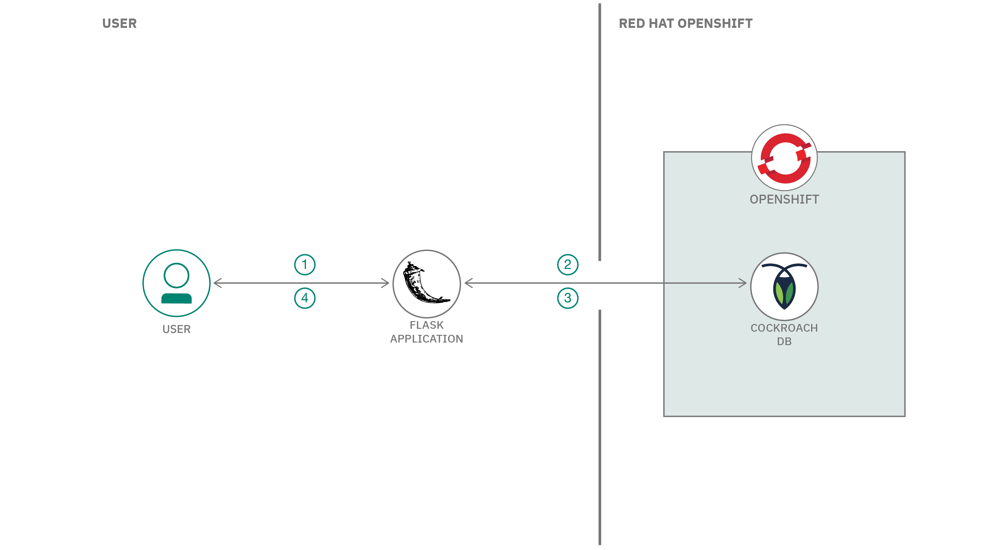
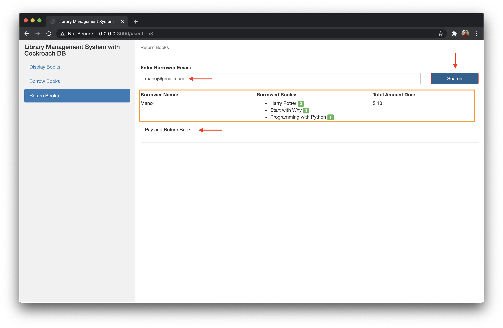

# Build a library management system using CockroachDB hosted on Red Hat Marketplace

A library management system is software that maintains a library's records. It captures data specific to the books on hand, which books have been rented, late fees, member information, and more.

In this code pattern, we show you how to build a library management system using CockroachDB hosted on Red Hat Marketplace. CockroachDB is an ultra resilient, distributed SQL that can easily scale-out serializable transactions for your apps and services. <!--EM: This is lifted straight from the RH Marketplace site. We have to be careful not to copy/paste their content. It's bad for SEO, for starters, and against our standards at IBM. What does this mean exactly?--> Its cloud-native architecture makes it easier to scale and also guarantees consistent transactions across multiple regions and multiple clouds.

When you have completed this code pattern, you will understand how to:

* Install CockroachDB Operator from Red Hat Marketplace on an OpenShift Cluster
* Create a CockroachDB cluster instance
* Create a user and database in CockroachDB
* Store and query unstructured JSON data from a third-party API in CockroachDB
* Manage CockroachDB cluster from the Cluster Overview page



## Flow

1. User performs an operation like borrowing a book or returning a book.
2. Application updates the appropriate CockroachDB table accordingly.
3. Application fetches the updated data from the table.
4. Application displays the updated data that was feteched from the table. 

## Steps

1. [Clone the repo](#1-clone-the-repo)
2. [Install the CockroachDB Operator from Red Hat Marketplace on OpenShift Cluster](#2-install-the-cockroachdb-operator-from-red-hat-marketplace-on-openshift-cluster)
3. [Create a Database in CockroachDB](#3-create-a-database-in-cockroachdb)
4. [Port forward CockroachDB](#4-port-forward-cockroachdb)
5. [Run the application](#5-run-the-application)
6. [Explore the library management system](#6-explore-the-library-management-system)


### 1. Clone the repo

Clone the `library-management-system-using-cockroachdb-hosted-on-rhm` repo locally. In a terminal, run:

```bash
git clone https://github.com/IBM/library-management-system-using-cockroachdb-hosted-on-rhm
```

### 2. Install the CockroachDB Operator from Red Hat Marketplace on OpenShift Cluster

>Note: If you have already followed the [Get started using a CockroachDB operator hosted on Red Hat Marketplace](https://developer.ibm.com/tutorials/get-started-using-a-cockroachdb-operator-hosted-on-red-hat-marketplace/) Tutorial, you can skip this section.

- Follow the steps to deploy the CockroachDB Operator from Red Hat Marketplace on a OpenShift Cluster:
  - [Get started using a CockroachDB operator hosted on Red Hat Marketplace](https://developer.ibm.com/tutorials/get-started-using-a-cockroachdb-operator-hosted-on-red-hat-marketplace/)

- Once you successfully set up CockroachDB Operator on OpenShift Cluster, you can create a database.

### 3. Create a database in CockroachDB

- Create a database called `library` in CockroachDB.

- In your terminal, run the following command to spin up a CockroachDB client:

```bash
$ kubectl run -it --rm cockroach-client \
--image=cockroachdb/cockroach \
--restart=Never \
--command -- \
./cockroach sql --insecure --host=example-cockroachdb-public.cockroachdb-test
```

- This should run the CockroachDB client and take you to a `SQL Command Prompt` as shown. If you don't see a command prompt, try pressing **Enter**.

```bash
root@example-cockroachdb-public.cockroachdb-test:26257/defaultdb>
```

- Create a database called `library` by running the following command:

<pre><code>
root@example-cockroachdb-public.cockroachdb-test:26257/defaultdb> <b>CREATE DATABASE library;</b>
</code></pre>

- You can come out of the SQL Prompt by the `\q` command:

<pre><code>
root@example-cockroachdb-public.cockroachdb-test:26257/defaultdb> <b>\q</b>
</code></pre>


### 4. Port forward CockroachDB

Once the CockroachDB Operator is set up successfully on your OpenShift Cluster, you need to port forward the CockroachDB database instance from OpenShift to establish connection in our application locally.  

- In your terminal, run the following command to port forward the `26257` port from the CockroachDB database instance.

> NOTE: You must be logged in with your `OC login` credentials before running the following commands.

```bash
$ kubectl port-forward example-cockroachdb-0 26257
```

```bash
Forwarding from 127.0.0.1:26257 -> 26257
Forwarding from [::1]:26257 -> 26257
```

### 5. Run the application

- Go to the cloned repo from [step 1](#1-clone-the-repo). In your terminal, run the following commands to install the required Python libraries and run the application. 

    - Install the required Python libraries by running the following command:

    ```bash
    $ pip install -r requirements.txt
    ```

    - Run the application as follows:

    ```bash
    $ python app.py
    ```

The application will be listening on `<http://localhost:8090>`

### 6. Explore the library management system

- Visit <http://localhost:8090> on your browser.

- There are three tabs in the system: Display Books, Borrow Books, and Return Books.

- In the Display Books tab, you can see three books listed. The book details include:
    - Book Name
    - Book Author
    - Book Availibility
    - Book Amount

>NOTE: These details are initialized by the Python script.


- Click the **Borrow Books** tab which shows which books you can borrow the from the store.<!--EM: Are we in a store or a library?--> Borrower details include:
    - Borrower Name
    - Borrower Email
    - Available books that can be borrowed

- Enter your name, email address, and book quantities that you wish to borrow and click **Submit** as shown.

- After you've successfully borrowed a book, you can see the number of availibile books decreasing.


- Click on the **Return Books** tab. You can return the borrowed books from here.

- Enter your email address for who borrowed the books, and click **Search**.

- Your name, the books that you have borrowed, and the total amount due will be displayed. Click on pay and return to return the books as shown.<!--EM: Why are we paying if it's a library? Or is it just that a library management system can be used within a store?-->



- After you successfully return the books, you will get an aleart like the following:


Notice that the availibility of the books increased again in the `Display Books` section.

You can verify the table in the ClockroachDB instance through the CockroachDB client from terminal.

- In your terminal, run the following command to spin up a CockroachDB client:

```bash
$ kubectl run -it --rm cockroach-client \
--image=cockroachdb/cockroach \
--restart=Never \
--command -- \
./cockroach sql --insecure --host=example-cockroachdb-public.cockroachdb-test
```

This should run the CockroachDB client and take you to a `SQL Command Prompt` as shown. If you don't see a command prompt, press **Enter**.

```bash
root@example-cockroachdb-public.cockroachdb-test:26257/defaultdb>
```

- From the CockroachDB client, run the following commands to view the `user`, `database` and `table` that were created by the Library Management Application:

    - View `users` by running the `SHOW users;` command as follows:
    <pre><code>root@example-cockroachdb-public.cockroachdb-test:26257/defaultdb> <b>SHOW users;</b>
    user_name
    `-------------`
    cpuser
    maxroach
    root
    (3 rows)

    Time: 3.037641ms
    </code></pre>

    - View `databases` by running the `SHOW databases;` command as follows:
    <pre><code>root@example-cockroachdb-public.cockroachdb-test:26257/defaultdb> <b>SHOW databases;</b>
    database_name
    `-----------------`
    bank
    defaultdb
    library
    postgres
    system
    (5 rows)

    Time: 2.890031ms</code></pre>

    - To view the tables present in the `library` database, run the `USE library;` command to switch to `library` database, and run `\d` command to view the `tables` as follows:
    
    <pre><code>root@example-cockroachdb-public.cockroachdb-test:26257/defaultdb> <b>USE library;</b>
    SET

    Time: 11.83841ms

    root@example-cockroachdb-public.cockroachdb-test:26257/library> <b>\d</b>
    table_name
    `----------------------`
    books
    borrowers
    (2 rows)

    Time: 3.684617ms</code></pre>

    - Finally, to view the tables `books` and `borrowers`, run the `SELECT` command as follows: <!--EM: I'm confused by the following code. Should that be "commands" instead of "command as this looks like 3 different chunks of code to me. -->
    
    <pre><code>root@example-cockroachdb-public.cockroachdb-test:26257/defaultdb> <b>SELECT * FROM books;</b>
    </code></pre>
    
    ```
    id |        book_name        | book_author | book_price | book_availability
    -----+-------------------------+-------------+------------+--------------------
    1 | Harry Potter            | Jk Rowling  |          2 |                30
    2 | Start with Why          | Simon Sinek |        1.5 |                20
    3 | Programming with Python | John Smith  |        1.5 |                25
    ```
   
    <pre><code>root@example-cockroachdb-public.cockroachdb-test:26257/defaultdb> <b>SELECT * FROM borrowers;</b>
    </code></pre>
    
    ```
              id         | borrower_name | borrower_email  | book_id | total_price | book_quantity
    ---------------------+---------------+-----------------+---------+-------------+----------------
    572547941512544257 | Manoj         | manoj@gmail.com | 1,2,3   |        12.5 | 4,1,2
    ```

<!-- keep this -->

## License

This code pattern is licensed under the Apache License, Version 2. Separate third-party code objects invoked within this code pattern are licensed by their respective providers pursuant to their own separate licenses. Contributions are subject to the [Developer Certificate of Origin, Version 1.1](https://developercertificate.org/) and the [Apache License, Version 2](https://www.apache.org/licenses/LICENSE-2.0.txt).

[Apache License FAQ](https://www.apache.org/foundation/license-faq.html#WhatDoesItMEAN)
